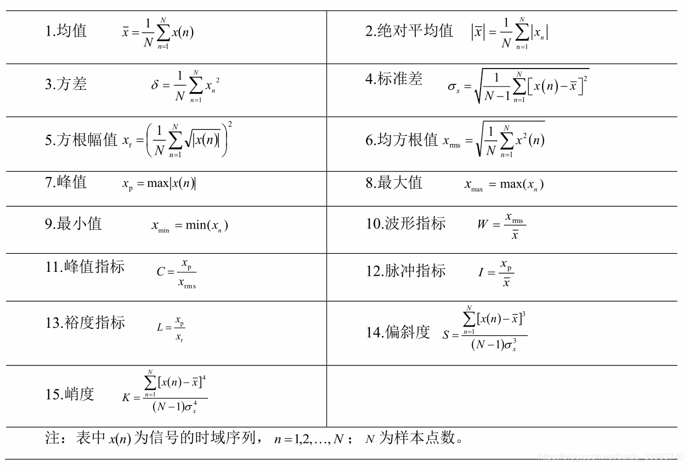
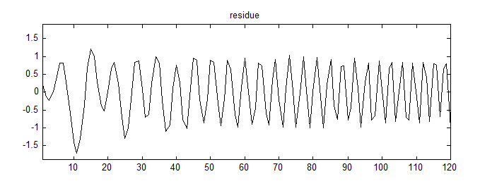

### 0 信号分析算法

#### A Python 连接SQL Server

```python
import pymssql
import matplotlib.pyplot as plt
import struct
import numpy as np
import pandas as pd

def conn():
    # 连接数据库：本地；账户名；密码；数据库名
    connect = pymssql.connect('(local)', '****', '******', 'DBName')
    if connect:
        print("数据库连接成功！")
    # 创建一个游标对象,python里的sql语句都要通过cursor来执行
    cursor = connect.cursor()
    # 查询：
    sql = "select * from dbo.RWaveData"
    cursor.execute(sql)  # 执行sql语句
    row = cursor.fetchone() #读取查询结果
    wave_list = []
    while row:
  		# 自定义读取操作
        wave_list.append(row[5])
        row = cursor.fetchone()
```

#### B 读取两字节，转为signed short型

```python
# 'h'为signed short型，占用2字节
def unpack_bytes(bytes_buf):
    bytes_len = int(len(bytes_buf)/2)
    return np.array(struct.unpack(bytes_len * 'h', bytes_buf)) / 100.0
```

#### C 将波形数据输出到达excel表

```python
# 按行读取数据库
 while row:
        # print(row[5])
        wave_list.append(row[5])
        row = cursor.fetchone()
 wave_values_int = []
 # 两字节拼接转int，注意高低位
 for row in wave_list:
    wave_values_int.append(unpack_bytes(row))

 # 将wave_values_int 写入excel表中
 wave_df = pd.DataFrame(wave_values_int)
 samp_freq_df = pd.DataFrame(samp_freq_list)
 # 修改列名
 rename_samp_freq = 'Samp_Freq'
 samp_freq_col = samp_freq_df.columns[0]
 samp_freq_df.rename(columns={samp_freq_col: rename_samp_freq}, inplace=True)
 # 拼接采样频率与波形数据
 wave_samp_freq = pd.concat([samp_freq_df, wave_df], axis=1)
 writer = pd.ExcelWriter('result/wave_samp_freq.xlsx')
 wave_samp_freq.to_excel(writer, 'page_1', float_format='%.5f')
 writer.save()
```


### 1 时域波形

时域波形很简单，几乎没有进行任何复杂的计算，只是把信号按时间顺序显示出来，但是它却隐含了很多有用的信息，而且有些信息是其它方法无法准确提供的。

以从时域波形上得到如下非常重要的信息：

- 振动的幅值，信号波形最大峰值到最小峰值的绝对数值就是峰峰值；
- 振动时域上的基本参数，如峰值指标、脉冲指标、裕度指标、峭度指标、偏度系数、波形指标。
- 振动的基本频率，就是在时间窗口时间内总共变化了多少次，1秒钟变化的次数就是频率；
- 主要频率结构，看见波形中的小周期形状了吗？看起来像个“w”或者“m”，这是存在2倍频的特征，当这个特征很明显时，说明存在着不对中问题或受到预负荷的影响；
- 振动的稳定性，如果波形大小比较均匀，没有大起大落，就说这个振动时稳定的；如果忽大忽小，忽快忽慢（波形的周期大小发生变化），那么就说这个振动是不稳定的。不稳定的振动必定反映了运行状态的不稳定；
- 可以判断是否存在干扰，如果在波形上出现了随机性的脉冲，且相同截面上两个通道上出现的时序不同，那么就可以说这个脉冲是干扰所致的，不是真实的振动。如果每个波形上都有相同间隔、相同幅值的脉冲，那么就要考虑测振传感器是否离相传感器太近，或者轴颈表面有划伤，或者轴颈的浅表层有缺陷，这些都会引起这种固定脉冲的。

时域波形虽然简单，但是却是分析振动问题不可缺少的工具，而且是判断信号真伪的基础工具。

Plot第5行数据：


### 2 [时频域指标](https://blog.csdn.net/weixin_38346042/article/details/125706578)

#### 2.1 时域指标

**时域指标**主要包含有效值、峰峰值、直流量、峰值、峰值指标、脉冲指标、裕度指标、峭度指标、偏度系数、波形指标、中心频率、均方频率、均方根频率等指标参数。


##### 2.1.1 读取波形数据

```python
def read_wave():
    path = 'datasets/wave_samp_freq_re.xlsx'
    wave_df = pd.read_excel(path, sheet_name='page_2')
    # short_df有256个测点
    short_df = wave_df.iloc[0, :]
    # long_df有2048个测点
    long_df = wave_df.iloc[1, :]

    short_wave = short_df[1:]
    short_wave = short_wave.dropna(how='all')
    short_samp_freq = short_df['Samp_Freq']

    long_wave = long_df[1:]
    long_samp_freq = long_df['Samp_Freq']

    return short_wave, short_samp_freq, long_wave, long_samp_freq
```

##### 2.1.2 获取时域指标

```python
# 获取时域指标
def get_time_domain_features(data):
    # data为一维振动信号:Series
    x_rms = 0
    absXbar = 0
    x_r = 0
    S = 0
    K = 0
    len_ = len(data)
    mean_ = data.mean(axis=0)  # 1.均值
    var_ = data.var(axis=0)  # 2.方差
    std_ = data.std(axis=0)  # 3.标准差
    max_ = data.max(axis=0)  # 4.最大值
    min_ = data.min(axis=0)  # 5.最小值
    x_p = max(abs(max_), abs(min_))  # 6.峰值
    for i in range(len_):
        x_rms += data.iloc[i] ** 2
        absXbar += abs(data.iloc[i])
        x_r += math.sqrt(abs(data.iloc[i]))
        S += (data.iloc[i] - mean_) ** 3
        K += (data.iloc[i] - mean_) ** 4
    x_rms = math.sqrt(x_rms / len_)  # 7.均方根值
    absXbar = absXbar / len_  # 8.绝对平均值
    x_r = (x_r / len_) ** 2  # 9.方根幅值
    W = x_rms / mean_  # 10.波形指标
    C = x_p / x_rms  # 11.峰值指标
    I = x_p / mean_  # 12.脉冲指标
    L = x_p / x_r  # 13.裕度指标
    S = S / ((len_ - 1) * std_ ** 3)  # 14.偏斜度
    K = K / ((len_ - 1) * std_ ** 4)  # 15.峭度

    fea = [mean_, absXbar, var_, std_, x_r, x_rms, x_p, max_, min_, W, C, I, L, S, K]
    return fea
```


#### 2.2 频域指标

振动信号频域分析首先需要把信号的时域波形借助离散[傅里叶](https://so.csdn.net/so/search?q=%E5%82%85%E9%87%8C%E5%8F%B6&spm=1001.2101.3001.7020)变换转化为频谱信息，公式如下：
$$
S(k)=\sum_{k=0}^{N-1} x(k \Delta t z) e^{\frac{-2 \pi j n k}{N}},(n=1,2, \ldots, N-1)
$$
式中：$x(k\Delta t)$为振动信号的采样值；$N$ 为采样点数；$ \Delta t$为采样间隔；$k$为时域离散值的序号。

利用旋转因子$W_N^{kn}=e^{\frac{-2\pi jnk}{N}}​$ 的周期性，对称性与缩放性进行快速傅里叶变化（FFT）。
$$
\mathrm{W}_{\mathrm{N}}^{\mathrm{a}+\mathrm{N}}=\mathrm{W}_{\mathrm{N}}^{\mathrm{a}}
$$

$$
\mathrm{W}_{\mathrm{N}}^{\mathrm{a}+\mathrm{N} / 2}=-\mathrm{W}_{\mathrm{N}}^{\mathrm{a}}
$$

$$
\mathrm{W}_{\mathrm{N}}^{2}=\mathrm{W}_{\mathrm{N} / 2}^{1}
$$

##### 2.2.1 [FFT蝶形计算](https://blog.csdn.net/weixin_40106401/article/details/106128194)

 FFT的计算过程运用了“分治算法”思想，并结合了旋转因子$W$的性质。具体证明过程如下：

1. 首先，我们把输入的时域信号 $x [ n ] $, $n = 0 , 1 , . . . , N − 1$ 根据索引分为奇偶两部分：
   $$
   f_{even}[n] = x[2n]
   $$

   $$
   f_{odd}[n] = x[2n+1]
   $$

   此时索引范围为：$n=0,1,2,...,N/2−1$

2. 对DFT公式进行化简：
   $$
   \mathrm{X}[\mathrm{k}]=\sum_{\mathrm{n}=0}^{\mathrm{N}-1} \mathrm{x}[\mathrm{n}] \mathrm{e}^{-\mathrm{jk} \frac{2 \pi}{\mathrm{n}} \mathrm{n}}, \mathrm{k}=0,1,2, \ldots, \mathrm{K}-1
   $$

   $$
   \mathrm{X}[\mathrm{k}]=\sum_{\mathrm{n}=0}^{\mathrm{N}-1} \mathrm{x}[\mathrm{n}] \mathrm{W}_{\mathrm{N}}^{\mathrm{kn}}, \mathrm{k}=0,1, \ldots, \mathrm{N}-1
   $$
   得到：
   $$
   \mathrm{X}[\mathrm{k}]=\sum_{\mathrm{n} \text { 为偶数 }} \mathrm{x}[\mathrm{n}] \mathrm{W}_{\mathrm{N}}^{\mathrm{kn}}+\sum_{\mathrm{n} \text { 为奇数 }} \mathrm{x}[\mathrm{n}] \mathrm{W}_{\mathrm{N}}^{\mathrm{kn}} \mathrm{k}=0,1, \ldots, \mathrm{N}-1
   $$
   具体点：
   $$
   \mathrm{X}[\mathrm{k}]=\sum_{\mathrm{m}=0}^{(\mathrm{N} / 2)-1} \mathrm{x}[2 \mathrm{~m}] \mathrm{W}_{\mathrm{N}}^{\mathrm{k} \cdot 2 \mathrm{~m}}+\sum_{\mathrm{m}=0}^{(\mathrm{N} / 2)-1} \mathrm{x}[2 \mathrm{~m}+1] \mathrm{W}_{\mathrm{N}}^{\mathrm{k} \cdot(2 \mathrm{~m}+1)}, \mathrm{k}=0,1, \ldots, \mathrm{N}-1
   $$
   根据旋转因子的缩放性，进一步换算：
   $$
   \mathrm{X}[\mathrm{k}]=\sum_{\mathrm{m}=0}^{(\mathrm{N} / 2)-1} \mathrm{f}_{even}[ \mathrm{m}] \mathrm{W}_{\mathrm{N/2}}^{\mathrm{k} \cdot  \mathrm{m}}+\sum_{\mathrm{m}=0}^{(\mathrm{N} / 2)-1} \mathrm{f}_{odd}[\mathrm{m}] \mathrm{W}_{\mathrm{N/2}}^{\mathrm{k} \cdot\mathrm{m}}, \mathrm{k}=0,1, \ldots, \mathrm{N}-1
   $$
   也即：
   $$
   \mathrm{X}[\mathrm{k}]=\mathrm{F}_{even}[\mathrm{k}] + \mathrm{W_N^kF_{odd}[k], k=0,1,\cdots,N - 1}
   $$
   其中，$F_{ e v e n }[ k ] $为偶数索引输入$f_{ e v e n} [ n ]$的DFT结果，$F_{ o d d} [ k ]$为奇数索引输入$f _{o d d }[ n ]$的DFT结果。

3. 根据周期性，$F$的时域输入长度均为$N/2-1$，故：
   $$
   \mathrm{F_{even}[k+n/2] = F_{even}[k]}
   $$

   $$
   \mathrm{F_{odd}[k+n/2] = F_{odd}[k]}
   $$

4. 再次简化，取（12）前半部分：
   $$
   \mathrm{X}[\mathrm{k}]=\mathrm{F}_{even}[\mathrm{k}] + \mathrm{W_N^kF_{odd}[k], k=0,1,\cdots,N/2 - 1}
   $$

5. 通过式（13，14），将（15）进一步转化为：
   $$
   \mathrm{X}[\mathrm{k+N/2}]=\mathrm{F}_{even}[\mathrm{k}] + \mathrm{W_N^kF_{odd}[k], k=0,1,\cdots,N/2 - 1}
   $$
   通过式（15,16）可以看出：**一个$N$点的DFT结果，可以被两个奇偶输入的DFT结果计算得到**。举个例子也即，8点的DFT，可以被偶4点DFT结果和奇4点DFT结果计算得到，同理奇/偶4点DFT又可以被2点DFT结果计算得到，以此类推，分治求解。

##### 2.2.2 FFT计算过程

步骤1：通过**二进制镜像**的方法，对时域信号的索引进行二进制编号，如下表最右列，从右向左反推输入计算序列，结果可以对应上图。

| 二进制：对应计算序列 | 转换 | 原始索引：对应二进制 |
| -------------------- | ---- | -------------------- |
| 000:0                | ←    | 0:000                |
| 100:4                | ←    | 1:001                |
| 010:2                | ←    | 2:010                |
| 110:6                | ←    | 3:011                |
| 001:1                | ←    | 4:100                |
| 101:5                | ←    | 5:101                |
| 011:3                | ←    | 6:110                |
| 111:7                | ←    | 7:111                |

 步骤2：奇偶项逐渐合并计算

##### 2.2.3 采样定理

**采样频率：**采样频率，也称为采样速度或者采样率，定义了每秒从连续信号中提取并组成离散信号的采样个数，它用赫兹（Hz）来表示。采样频率的倒数是采样周期或者叫作采样时间，它是采样之间的时间间隔。通俗的讲采样频率是指计算机每秒钟采集多少个信号样本。

**采样定理：**所谓采样定理 ，又称香农采样定理，奈奎斯特采样定理，是信息论，特别是通讯与信号处理学科中的一个重要基本结论。采样定理指出，**如果信号是带限的，并且采样频率高于信号带宽的两倍**，那么，原来的连续信号可以从采样样本中完全重建出来。

定理的具体表述为：在进行模拟/数字信号的转换过程中，当[采样频率](https://baike.baidu.com/item/%E9%87%87%E6%A0%B7%E9%A2%91%E7%8E%87) $fs​$ 大于信号中最高频率 $f_{max}​$ 的2倍时，即

$fs>2*f_{max}​$ 采样之后的数字信号完整地保留了原始信号中的信息，一般实际应用中保证采样频率为信号最高频率的2.56～4倍；采样定理又称[奈奎斯特定理](https://baike.baidu.com/item/%E5%A5%88%E5%A5%8E%E6%96%AF%E7%89%B9%E5%AE%9A%E7%90%86)。

##### 2.2.4 FFT结果


##### 2.2.5 计算频域指标

求得[频谱](https://so.csdn.net/so/search?q=%E9%A2%91%E8%B0%B1&spm=1001.2101.3001.7020)信息后，可根据频域统计指标公式计算相应的值，公式如下：


```python
# 获取频域特征:f是傅里叶变换之后的频率轴，y是傅里叶变换之后的幅值，也就是平时画的频谱图的x轴和y轴。
def get_fre_domain_features(f, y):
    fre_line_num = len(y)
    p1 = y.mean()                                          	    # 频谱均值
    p2 = math.sqrt(sum((y - p1) ** 2) / fre_line_num)       	# 频谱均方根值
    p3 = sum((y - p1) ** 3) / (fre_line_num * p2 ** 3)
    p4 = sum((y - p1) ** 4) / (fre_line_num * p2 ** 4)
    p5 = sum(f * y) / sum(y)                              		# 频率重心
    p6 = math.sqrt(sum((f - p5) ** 2 * y) / fre_line_num)
    p7 = math.sqrt(sum(f ** 2 * y) / sum(y))               		# 均方根频率
    p8 = math.sqrt(sum(f ** 4 * y) / sum(f ** 2 * y))
    p9 = sum(f ** 2 * y) / math.sqrt(sum(y) * sum(f ** 4 * y))
    p10 = p6 / p5
    p11 = sum((f - p5) ** 3 * y) / (p6 ** 3 * fre_line_num)
    p12 = sum((f - p5) ** 4 * y) / (p6 ** 4 * fre_line_num)
    p13 = sum(abs(f - p5) * y) / (math.sqrt(p6) * fre_line_num)  # 标准差频率
    p = [p1, p2, p3, p4, p5, p6, p7, p8, p9, p10, p11, p12, p13]
    return p

def nextpow2(x):
    if x == 0:
        return 0
    else:
        return int(np.ceil(np.log2(x)))


# X[k] = \sum_{n=0}^{N-1} x[n] * e^{-i2\pikN_n}
# k为采样频率，X[k]为频率信号的幅值。
def Do_fft(sig, Fs):  # 输入信号和采样频率
    xlen = len(sig)
    sig = sig - sig.mean()
    NFFT = 2 ** nextpow2(xlen)              # 采样点
    yf = np.fft.fft(sig, NFFT) / xlen * 2
    yf = abs(yf[0:int(NFFT / 2 + 1)])       # 取半操作（对称性，取一半区间）
    f = Fs / 2 * np.linspace(0, 1, int(NFFT / 2 + 1))
    f = f[:]

    x = np.arange(xlen)/Fs
    half_x = np.arange((int(xlen/2)+1))/Fs
    plt.figure(figsize=(8, 4))
    plt.subplot(121)
    plt.plot(x, sig)
    plt.title('原始波形')

    plt.subplot(122)
    plt.plot(f, yf, 'r')
    plt.title('单边振幅谱', color='red')
    plt.show()
    return f, yf

if __name__ == '__main__':
    short_wave, s_samp_fre, long_wave, l_samp_fre = read_wave()
    f, y = Do_fft(short_wave, s_samp_fre)
    p = get_fre_domain_features(f, y)
```


#### 2.3 时频域指标解析

##### 2.3.1 频域指标解析

**频域指标**只要包括0.5X至3X矢量，4X至12X的幅值。

**振动峰峰值**是衡量振动总体水平的基本指标，一般来说，振动峰峰值较大时，往往预示着某些部件存在故障。但是也要注意一点，当振动峰峰值突然下降时，而且下降的幅度较大时，那也是故障的表现，往往是重大故障的表现。

振动时因力而起的。既然力是一个矢量，振动当然也是一个矢量，因此单纯用幅值来衡量振动时不够的。另外，对于轴振来说，其动态振动是很重要的监测参数，其位置更是分析故障的“基准”。因此，除了振动峰峰值以外，下一项就是**间隙电压**。即便是振动幅值没有变化，甚至有所降低，当间隙电压发生较显著的变化时，那一定是状态发生了显著的变化。

在3个矢量值的监测中，**0.5X矢量**主要监测的是**轴系在滑动轴承中的稳定性问题**，这个矢量值变化了，代表轴系在滑动轴承中的稳定状态发生了变化，如发生了油膜涡动或油膜振荡。不要小看这个次谐波成分，它的出现一定会影响轴系的平稳运行，因为异步涡动会使转子轴颈受到一个交替变化的拉力或压力，时间长了转子就会因疲劳而发生事故，所以0.5X分量（**实际的范围是0.2X-0.86X**这样一个范围）是一个 “不受欢迎的”成分虽然对电机不存在油膜涡动的问题，但外面还是希望要了解这个频率成分变化代表的意义。

**1X矢量是检测转子平衡状态的重要指标**。既然是矢量，那么就包含了幅值和相位两个部分，无论幅值发生变化，还是相位发生变化，均代表平衡状态发生了变化。比如说转子突然发生了质量缺损性的失衡，1X矢量肯定会发生“突变”，往往是幅值和相位都会变化。如果看到1X矢量在两个“区域”内来回变化，那么就有必要考虑一下监测的机组转动体上有没有可以来回滑动的质量块，因为有些机组转子上是配有这种可以滑动的配重块的，如果在运行过程中因没有锁紧而松动，就有可能出现这种来回徘徊的症状的。

**2X矢量**除了可以**监测对中**情况外，还有一个最大的用途是**监测转子横向裂纹发展**的。2X矢量区域监测已成为标准的转子横向裂纹监测工具，而且具有理想的准确度。

##### 2.3.2 频域指标解析

另外，在整个模块里还有一些，时域特征指标是一系列，反映了振动信号特征的计量值，其意义为：

- **有效值**：振动平均能量；

- **偏度指标**：反映信号不对称程度的指标，当信号严重不对称时，往往与严重故障有联系；
- **峭度指标**：反映信号中脉冲大小的指标，如滚动轴承的正常峭度指标值应在3～5之间。但峭度指标是一个相对值，滚动轴承在初期运行阶段也可能具有较高的峭度指标值，但因有效值和峰值均较低，所以并不见得一定是故障；

- **峰值**：信号峰峰值的一般。峰值具有时间上的不稳定性，但对于滚动轴承或齿轮的局部故障早期预警具有优势。

高阶分量幅值的变化时诊断故障的辅助成分，其相位已经没有物理意义了，所以系统在3X以上的高阶成分监测中没有涉及相位信息。操作建议如下：

- 关注**峰峰值**，更要关注间隙电压的变化；
- 关注**0.5X、1X和2X矢量的变化**，就掌握了机组的主要状态；
- 振动变大了固然可怕，突然**变小**更可怕，因为极有可能产生了**摩擦**。

通过振动参数总表，获得了转子是否存在平衡问题、有无失稳现象以及是否存在不对中或预负荷影响，甚至还可以得到转子横向裂纹的有关信息，基本上掌握了机组运行状态的状态信息，对于机组操作人员来说，这些信息时重要的，也是必须要掌握的。




### 3 频谱相位图

##### 3.1 频谱分析

频谱分析大概是故障诊断中最常用的工具了，因为机器常见故障在频谱上表现为不同的“特征频率”成分，所以可以借助频谱分析来诊断故障的类型。

按照FFT算法，任何一个复杂的周期信号都可分解为一系列简谐信号，将所有分解后的简谐信号按频率进行排列就是频谱。谱就是按照一定规律排列的图表，如菜谱、乐谱等。

不同类型的故障会表现出不同的频率分布特性，这就是分析故障时经常用到频谱的原因。

当然，诊断故障绝对不是简单到“按图索骥”，还有很多细节需要注意：

- 与**转子**与关的故障特征频率往往处于**3X以内**，如1X多与转子的平衡状态有关，但是当两个通道的**1X幅值相差很大**时，就有可能是**预负荷**的影响；同样**2X**多与转子之间的**对中状态**有关，但对中状态最容易受到预负荷的影响，所以正确地识别预负荷是很重要的；
- 要注意频谱图的基底噪声水平，就是**频谱图偏离0点的程度**。如果频谱具有较强的基底噪声，那么一定是与**摩擦力**有关的。存在较强的摩擦力时，有可能特征频率的幅值不是很高，但较高的噪声水平反映了较高的平均能量，又与摩擦力有关，所以是不容忽视的；
- 利用频谱还可以**识别冲击力**，对于滑动轴承+电涡流传感器系统来说，存在冲击信号的来源多属干扰，但对于壳振来说，冲击信号多与松动有关。

系统建议是：

- 当发现当前振动主要是以1X为主，其它分量很小时，要考虑两个通道的**1X幅值**是否**相差**不大，按照传感器安装的方式来说，两个方向上的支撑刚度应该是差不多的，如果出现较大的偏差，一个幅值很高，一个幅值很低，那就要考虑是否有**预负荷**的影响了；
- 如果频谱上出现了1X、2X……直至最高分析频率范围内**逐项降低分布的谐波特征**，有两种可能需要区别，一是是否发生了摩擦，可以对照波形看是否存在**“削波”特征**，同时看一看**轴心位置**是否**偏心率**较大，一般这几项综合起来诊断摩擦是比较准确的；而是信号中存在固定的“脉冲”，因此使得频谱中出现**高次谐波**，这种情况极有可能是轴颈表面或浅表层**缺陷问题**，**并不是真正的振动**；
- 出现**[分数谐波](https://baike.baidu.com/item/%E5%88%86%E6%95%B0%E8%B0%90%E6%B3%A2/9455538)**时一定要注意了，因为很可能是**转子和轴承“亲密接触”了**。因为摩擦过程是一个非线性过程，往往伴随着冲击力的产生，有可能出现的频谱结构是：**1/2X、1X（2/2X）、3/3X、2X（4/2X）、5/2X**等，这是典型的非线性特征，一定要特别关注才行呀；
- **不对中问题**是旋转机械中常见的问题，是一种**三维问题**。由于一套机组有多台机器组成，各自具有自己的中心线和安装方位，相邻机器就具有不同的中心线和方位。实际诊断经验表明，**对中引起的机械故障占的比例较高**，对中不良引起其它相关故障，及早发现不对中并处理是保证机组平稳运行的重要手段。

关于不对中的分类，许多教科书或在实际工作中都有了详细的了解，在此不再细述，主要将不对中的诊断思路和特征介绍一下。

一般的诊断“规则”说，**不对中的特征是明显的2X分量**，且产生明显的轴向振动，这种说法和实际没有矛盾，但不全面。

不对中初期，由于[预负荷](https://baike.baidu.com/item/%E9%A2%84%E8%B4%9F%E8%8D%B7/10613930)的作用还不明显，振动信号表现出1X和2X分量特征，且1X分量幅值大于2X分量幅值；随着不对中的加剧，预负荷的作用逐渐显露出来，2X分量幅值开始增大，1X分量幅值开始下降，**逐步发展到2X分量幅值大于1X分量幅值**；到此为止，信号的特征与教科书所说的“规则”完全吻合；但当不对中加剧到一定程度，2X分量幅值开始下降，1X分量幅值开始上升，难道是运行状态好转了？不是。这个现象发展的目标是直到消除外部预负荷对联轴节的影响，达到新的对中状态，预负荷消除了，**但新的对中造成了联轴节或轴承的磨损**，轴承承受的应力更大，甚至引起轴承座松动。这些现象在频谱中均可以得到表现。

还有一种方法来判断不对中的严重程度，用来做运行指导值也是不错的。一般说来，**运行平稳的机器其轴向振动不大于径向振动的1/10**，基于这个原则，轴向振动的幅值与径向最大振动幅值之比可用作判断指标。

不对中故障利用**比较两个端面轴中心线位置的方法**进行诊断，比频谱分析更容易掌握和直观。

频谱上另一类特征频率是与滚动轴承、齿轮故障特征相关的，如滚动轴承内圈、外圈、滚动体、保持架等特征频率、齿轮的啮合频率等。**对于电机的诊断，尤其要关注3X以上的非整数倍转速频率和谐波**。如果发现了3X以上的非整数倍转速频率极其谐波，比如**3.1X、6.2X、9.3X等，有可能是滚动轴承的问题**；齿轮特征频率要关注的重点是啮合频率±故障齿轮轴转速及其谐波，另外也要关注分数倍的啮合频率成分，因为这种成分多与齿轮齿侧间隙过大有关。

说到齿轮故障诊断，频谱分析的重点则是**边频带分析**了，因为边频带的形状和分布包含了丰富的齿面状态信息。在分析边频带时，建议注意以下几点：

- 边频带的间隔就是齿轮轴的转速，这是因为齿轮偏心、齿距的缓慢周期性变化及载荷的周期性波动等缺陷存在，齿轮旋转一周，这些缺陷便重复一次，也就是说，这些缺陷的重复频率和该齿轮的旋转频率是一致的；
- 齿轮的**点蚀**等分布故障形成的边频带阶数少而且集中在啮合频率及其谐波**两侧**，分布比较有规律；
- **齿轮剥落、齿根裂纹**及**部分断齿**等局部故障会产生瞬态冲击，形成的**边频带分布宽，谱线分散**，高阶边频有可能相互叠加，因此形状不太规则。

**建议先把下面的规则记住，对识别常见的机械故障是非常必要的：**

| 振源                                                         | 激励频率                                                     | 主要方向                                                     | 说明                                                         |
| ------------------------------------------------------------ | ------------------------------------------------------------ | ------------------------------------------------------------ | ------------------------------------------------------------ |
| 两端支撑转子不平衡<br />悬臂转子不平衡<br />转子弯曲         | 1X<br />1X<br />1X                                           | 垂直与水平<br />轴向、垂直、水平<br />轴向、垂直、水平       | 常见故障<br />轴向弯曲<br />临时性不平衡                     |
| 平行不对中<br />角度不对中<br />复合不对中<br />联轴器磨损   | 2X<br />1X<br />1X，2X<br />3X                               | 垂直与水平<br />轴向<br />轴向、垂直、水平<br />任何、所有方向 | 联轴器两侧<br />联轴器两侧<br />常见<br />联轴器两侧         |
| 滚动轴承                                                     | 非整数倍频率                                                 | 垂直、水平、轴向                                             | 谐波、1X边带、基底噪声                                       |
| 轴及滑动轴承松动<br />基础刚度差<br />电机电气故障电机三相不平衡<br />电机或泵磨损 <br />气蚀 | 1X及其谐波<br />1X<br />导条通过频率100Hz<br />叶轮或叶片通过频率 噪声 | 垂直、水平、轴向<br />水平<br />垂直、水平、轴向<br />垂直、水平、轴向<br />垂直、水平、轴向 <br />垂直、水平、轴向 | 高次4X～15X谐波<br />水平高于垂直6dB<br />100Hz边带<br />两倍电源频率<br />叶轮或叶片通过频率及其谐波<br />随机噪声、20X－50X |


### 4 倒谱分析

倒频谱是分析周期性频谱的“利器”，它可以将频谱上等间隔分布的谱线用**倒频谱上一根线**来表达，对于那些**调制源较多、频谱识别困难**的场合，倒频谱可能就是唯一的分析工具了。

对于高速大型旋转机械，其旋转状况是复杂的，尤其当设备出现不对中，轴承或齿轮的缺陷、油膜涡动、磨擦、陷流及质量不对称等现象时，则振动更为复杂，用一般频谱分析方法已经难于辩识(**识别反映缺陷的频率分量**)，而**用倒频谱，则会增强识别能力**。如一对工作中的齿轮，在实测得到的振动或噪声信号中，包含着一定数量的周期分量。如果齿轮产生缺陷，则其振动或噪声信号还将**大量增加谐波分量及所谓的边带频率成分**。假设对于一个具有四个轮幅的100个齿的齿轮，其轴准转数为50转/秒，而其啮合频率5000Hz。其幅值(啮合力的大小) 则由每转四次的周期为200HZ所调制(因为有四个轮幅的影响)。所以在测得的振动分量中，不仅有明显的轴转数50HZ及啮合频率(5000HZ) 外，还有4800HZ及5200HZ的边带频率。如果齿轮缺陷严重或多种故障存在，以致许多机械中经常出现的不对准、松动、及非线性刚度等原因，或者出现拍波截断等原因时，则边带频率将大量增加。在**一个频谱图上出现过多的频差，难以识别，而倒频谱图则有利于识别**，如下图所示。图(a)是一个减速箱的频谱图，图(b)是它的倒频谱图。从倒谱图上清楚地看出，有两个主要频率分量:117.6Hz(85ms)及48.8Hz(20.5ms)。


简言之，倒频谱分析技术是将时域振动信号的功率谱对数化，然后进行逆傅里叶变化后得到的。倒频谱的水平轴为“倒频率”的伪时间，垂直轴为对应倒频率的幅值，其计算公式为：
$$
\begin{array}{c}
X(f)=F F T[X(t)] \\
S_{x x}(f)=X^{2}(f) \\
C_{x x}(t)=F F T^{-1}\left[10 \lg S_{x x}(f)\right]
\end{array}
$$
其中，$X(t)$ 是时域振动信号，$S_{xx}(f)$ 是时域振动信号的功率谱，$C_{xx}(t)$ 为时域振动信号的倒频谱。


```python
def cep_specturm(yf,N):
    ceps = np.fft.ifft(np.log(np.abs(yf))).real
    ceps = np.abs(ceps)[:N // 2]

    plt.figure(figsize=(10, 5))
    plt.subplot(333)
    plt.plot(ceps, 'gray')
    plt.title('Cepstrum', color='gray')
    plt.xlabel('Frequency (Hz)')
    plt.show

    return ceps
```


### 5 包络谱

包络计算的原理见图。


包络分析是滚动轴承、齿轮故障分析中的传统方法，包络频率范围对正确提取故障特征信号非常关键，因此本系统给出了设置的项目，以帮助用户能够进行包络效果的对比。

**Hilbert变换**通常用来得到解析信号，可以用来对窄带信号进行解包络，并求解信号的瞬时频率。对信号进行Hilbert变换时，会使信号产生一个90°的相位移，并与原信号构成一个解析信号，即为包络信号。Hilbert变换的实质上相当于把原信号**通过了一个原始信号和一个信号做卷积的滤波器**。可以看成是将原始信号通过一个滤波器。

在数学与信号处理的领域中，一个实值函数 $x ( t )$，其Hilbert变换记作 $\hat{x}(t)$ 定义为：
$$
\begin{aligned}
\hat{x}(t) & =H[x(t)] \\
& =x(t) * \frac{1}{\pi t} \\
& =\frac{1}{\pi} \int_{-\infty}^{\infty} \frac{x(\tau)}{t-\tau} d \tau
\end{aligned}
$$
在此 $H$ 表示为[希尔伯特](https://so.csdn.net/so/search?q=%E5%B8%8C%E5%B0%94%E4%BC%AF%E7%89%B9&spm=1001.2101.3001.7020)变换。

基于Hilbert变换的包络谱分析**简单明了，可解释性较强，有数学理论作为保证**，在诸如**管道泄漏检测、机械故障诊断、舰船噪声分析、结构损伤识别、油中水分含量检测、电池故障分析、辐射源个体识别、负荷状态识别、污染预测**等方面有重要应用。

```python
# 包络谱
def envelop(sig, Fs):
    sigH = signal.hilbert(sig)
    sigE = np.abs(sigH)
    sigE = sigE - np.mean(sigE)
    sigH1 = np.fft.rfft(sigE) / len(sigE)
    mag = abs(sigH1) * 2
    fre = np.linspace(0, Fs/2, int(len(sigE) / 2 + 1))
    return mag, fre
```


### 6 短时傅里叶变换

短时FFT分析是一种时频分析方法，适合用于**非平稳过程信号**的分析。

传统的谱分析没有强调时间轴上的变化特征，因此在分析的时间窗口内**具有平均效应**，给出一个平均的信息。如同一个房间内有很多人，身高体重不同，传统的谱分析给出的信息可能仅限于男人几个、女人几个、平均身高多少类似的信息。而我们要求的信息可能不止这么简单，我们可能还要求有年龄段的信息。

所谓短时FFT就是**把时间信号分割为若干个时间窗口**，这些时间窗口是相连的，我们**假定每个很短时间的窗口内信号是平稳**的，即按照传统的FFT分析的思路来解决很短时间窗口内信号的分析问题，于是就会输出一系列频谱，**按照时间顺序排列出来，就成了短时FFT谱**。短时就是很短的时间。

短时FFT**不但具备了频率域的信息，而且保留了时间域信息**。对于滚动轴承故障分析，有些故障信号在时间上呈不稳定特征，如调频现象，用传统的频谱分析有可能因“时间平均效应”而无法给出正确的故障特征信息，比如因局部故障而产生的脉冲信号时间很短，但具有较高的幅值，在传统频谱中就可能因平均效应而无法正确地表达出来，而这恰恰是诊断故障的关键信息。**短时FFT保留了时间轴上变化的信息**，因此非常适合用于“非平稳”信号的分析，而且可以观察到与时间变化相符合的信号特征。

- 从时域到频域的表达式（正变换）

$$
\mathrm{X}_{\mathrm{l}}[\mathrm{k}]=\sum_{\mathrm{n}=-\mathrm{N} / 2}^{\mathrm{N} / 2-1} \mathrm{w}[\mathrm{n}] \mathrm{x}[\mathrm{n}+\mathrm{lH}] \mathrm{e}^{-\mathrm{j} 2 \pi \mathrm{kn} / \mathrm{N}} \quad l=0,1, \ldots, \mathrm{L}
$$

实质就是在时域加窗，再对加窗后的信号进行频域的分析。$w$ 表示分析窗，长度为 $N$，$l$ 表示帧序号，$H​$ 表示不同帧之间的跳跃步长。

- 从频域到时域的表达式（反变换）


$$
\mathrm{y}[\mathrm{n}]=\sum_{\mathrm{l}=0}^{\mathrm{L}-1} \mathrm{Shift}_{\mathrm{lH}, \mathrm{n}}\left[\frac{1}{\mathrm{~N}} \sum_{\mathrm{k}=-\mathrm{N} / 2}^{\mathrm{N} / 2-1} \mathrm{X}_{\mathrm{l}}[\mathrm{k}] \mathrm{e}^{\mathrm{j} 2 \pi \mathrm{kn} / \mathrm{N}}\right]
$$

```python
# 短时傅里叶变换：STFT
def stft(sig, Fs):
    fre, t, amp = signal.stft(sig, Fs, nperseg=256)
    z = np.abs(amp.copy())
    return fre, t, z
```


### 7 Wingner-Ville分布

Wigner分布被看作是信号在时间—频率平面上的二维能量分布。它具有较高的分辨力，能量集中性和跟踪瞬时频率的能力。

*Wigner-Ville*分布可以看成**信号的瞬时对称相关函数的傅里叶变换**。WVD:
$$
W_{s}(t, f)=\int_{-\infty}^{\infty} s\left(t+\frac{\tau}{2}\right) s^{*}\left(t-\frac{\tau}{2}\right) e^{-j 2 \pi f t} d \tau
$$
其中 $s\left(t+\frac{\tau}{2}\right) s^{*}\left(t-\frac{\tau}{2}\right)$ 就是信号 $s(t)$ [瞬时自相关函数](https://www.zhihu.com/search?q=%E7%9E%AC%E6%97%B6%E8%87%AA%E7%9B%B8%E5%85%B3%E5%87%BD%E6%95%B0&search_source=Entity&hybrid_search_source=Entity&hybrid_search_extra=%7B%22sourceType%22%3A%22answer%22%2C%22sourceId%22%3A371502184%7D)$R(t,τ)$ 。

```python
from tftb.processing import WignerVilleDistribution
def wvd(sig):
    wvd = WignerVilleDistribution(sig)
    amp, ts, fre = wvd.run()
    return amp, ts, fre
```


### 8 EMD分解

EMD (Empirical Mode Decomposition)最显著的特点，就是其**克服了基函数无自适应性的问题**。回忆小波分析部分的内容，我们会知道小波分析是需要选定某一个小波基的，小波基的选择对整个小波分析的结果影响很大，一旦确定了小波基，在整个分析过程中将无法更换，即使该小波基在全局可能是最佳的，但在某些局部可能并不是，所以小波分析的基函数缺乏适应性。

通俗的说，用EMD有什么好处呢？对于一段未知信号，**不需要做预先分析与研究**，就可以直接开始分解。这个方法会自动按照一些固模式按层次分好，而不需要人为设置和干预。

再通俗一点，EMD就像一台机器，把一堆混在一起的硬币扔进去，他会自动按照1元、5毛、1毛、5分、1分地分成几份。

#### 8.1 内涵模态分量

内涵模态分量（Intrinsic Mode Functions, IMF）就是原始信号被EMD分解之后得到的各层信号分量。EMD的提出人黄锷认为，任何信号都可以拆分成若干个内涵模态分量之和。而内涵模态分量有两个约束条件：

1）在整个数据段内，极值点的个数和过零点的个数必须相等或相差最多不能超过一个。

2）在任意时刻，由局部极大值点形成的上包络线和由局部极小值点形成的下包络线的平均值为零，即上、下包络线相对于时间轴局部对称。

#### 8.2 EMD分解过程

EMD的分解过程是简单直观的：

1）根据原始信号上下极值点，分别画出上、下包络线。

2）求上、下包络线的均值，画出均值包络线。


3）原始信号减均值包络线，得到中间信号。



4）判断该中间信号是否满足IMF的两个条件，如果满足，该信号就是一个IMF分量；如果不是，以该信号为基础，重新做1）~4）的分析。IMF分量的获取通常需要若干次的迭代。


使用上述方法得到第一个IMF后，用原始信号减IMF1，作为新的原始信号，再通过1）~4）的分析，可以得到IMF2，以此类推，完成EMD分解。


```python
from PyEMD import EEMD, EMD, Visualisation

def emd(sig, fs):
    global E_imfNo
    E_imfNo = np.zeros(50, dtype=np.int)
    # EEMD options
    max_imf = -1
    xlen = len(sig)
    N = 2 ** nextpow2(xlen)  # 采样点
    # 将Series->np.array
    sig = np.array(sig)

    tMin, tMax = 0, N/fs
    T = np.linspace(tMin, tMax, num=N)

    # EEMD计算
    eemd = EEMD()
    eemd.trials = 50
    eemd.noise_seed(12345)
    E_IMFs = eemd.eemd(sig, T, max_imf)

    imfNo = E_IMFs.shape[0]
    # EE_IMFs = E_IMFs[0:7, :]
    # Plot results in a grid
    c = int(np.floor(np.sqrt(imfNo + 1)))
    r = int(np.ceil((imfNo + 1) / c))
    plt.ioff()
    plt.subplot(r, c, 1)
    plt.plot(T, sig, 'r')
    plt.xlim((tMin, tMax))
    plt.title("Original signal")
    for num in range(imfNo):
        plt.subplot(r, c, num + 2)
        plt.plot(T, E_IMFs[num], 'g')
        plt.xlim((tMin, tMax))
        plt.title("Imf " + str(num + 1))
    plt.tight_layout()
    plt.show()
```


### 9 连续小波变换

定义：如果函数 $ψ(t)∈L^2(R)$ 满足下述三个条件(公式)：
$$
\begin{array}{c}
\int \psi(t) \mathrm{d} t=0 \\
\int|\psi(t)| \mathrm{d} t<+\infty \\
C_{\psi}=\int_{-\infty}^{+\infty} \frac{|\hat{\psi}(\omega)|^{2}}{|\omega|} \mathrm{d} \omega<+\infty
\end{array}
$$
则称函数 $ψ(t)​$ 为基本小波。

> 以小写字母$f(t)、x(t)、ψ(t)$等表示源时间变量信号，用相同的字母加上帽子符号“^”表示信号的傅里叶变换。

在上面的公式中：

1. 条件1说明 $ψ(t)​$ 是一个正负交替的函数或振荡的波，其函数值在正负两部分的某种能量相等，使得其平均值等于零。

2. 条件2说明 $ψ(t)$ 是一个“小的波”(small wave或wavelet)，这种振荡波形的主要能量集中在有限的范围内，或者随着自变量的增大波形幅值快速衰减到零。

3. 条件3只是为了使小波变换存在逆变换而施加的限制。

满足上述定义的函数或波形就是小波变换中的基本小波，而信号的小波变换一般指将待分析信号 $f(t)$ 分解到【由基本小波 $ψ(t)$ 经不同尺度的膨胀或伸缩、再平移到不同位置处所形成的】“子波”簇：
$$
\left\{\psi_{a, b}(t)=a^{-\frac{1}{2}} \psi\left(\frac{t-b}{a}\right)\right\}
$$
上，最后得到的小波变换结果被称为小波系数，而小波逆变换则是由小波系数重建或恢复原始待分析信号。

设函数 $ψ(t)$ 是满足上述定义中三个条件的基本小波，对任意信号$f(t)∈L^2(R)$，其连续小波变换(Continuous Wavelet Transform，CWT)定义为：
$$
W T_{\psi} f(a, b)=\int_{-\infty}^{+\infty} f(t) \bar{\psi}_{a, b}(t) \mathrm{d} t=a^{-\frac{1}{2}} \int_{-\infty}^{+\infty} f(t) \bar{\psi}\left(\frac{t-b}{a}\right) \mathrm{d} t
$$
其中，$a>0$ 为尺度参数，$b$ 为位置参数。而 $\bar{\psi}(t)$ 表示 $ψ(t)$ 的复共轭。

```python
def cwt(sig, fs):

    total_scal = len(sig)
    t = np.arange(total_scal) / fs
    wave_name = 'cgau8'
    fc = pywt.central_frequency(wave_name)
    c_param = 2 * fc * total_scal
    scales = c_param / np.arange(total_scal, 1, -1)
    [cwt_mat, fre] = pywt.cwt(sig, scales, wave_name, 1.0 / fs)

    return t, fre, cwt_mat

```


### 10 小波包分解

**Fourier变换：** 使用的是一种全局的变换，无法表述非平稳信号最根本和最关健的时一频局域性质。

**加窗Fourier变换：**把时域和频域分解为大小相等的小窗口，对信号的任何部分都米用相同的时间和频率分辨率，不能在时间和频率两个空间同时以任意精度逼近被测信号。

**小波变换：**是一种窗口大小（即窗口面积）固定但形状可以改变，时间窗和频率窗都可以改变的时一频局部化分析方法，在高频段频率分开率较差，而在低频段时间分舞率较差。

**小波包变换：**将频带部分多层次划分，对多分辨率分析没有细分的高频部分进一步分解，并能够根据被分析信号的特征，自适应地选择相应的频带，使之与信号频语相匹配，从而提高了时频分辨率。

**小波分解** 

小波变换只对信号的**低频部分**做进一步分解，而对高频部分也即信号的细节部分不再继续分解，所以小波变换能够很好地表征一大类以低频信息为主要成分的信号，不能很好地分解和表示包含大量细节信息（细小边缘或纹理）的信号，如非平稳机械振动信号、遥感图象、地震信号和生物医学信号等。

**小波包分解**

小波包变换既可以对**低频部分**信号进行分解，也可以对**高频部分**进行分解，而且这种分解既无冗余，也无疏漏，所以对包含大量中、高频信息的信号能够进行更好的时频局部化分析。

小波包分解实际是对小波分解进行改进，将信号高频分量和低频分量都进行分解，比小波变换划分更加精细和全面，更能体现出信号全频率特点，特征向量能够自适应选择频带，具有时频局部化特点，特征与频谱对应，从而提高信号的时频分辨率。

**小波包**

设 $\varphi(x)$ 和 $\psi(x)$ 分别是尺度函数和小波函数，令：
$$
\begin{array}{c}
\left\{\begin{array}{l}
\psi_{0}(x)=\varphi(x) \\
\psi_1(x)=\psi(x)
\end{array}\right. \\
\left\{\begin{array}{c}
\varphi_{2 l}(x)=\sum_{k=-\infty}^{+\infty} h_{k} \varphi_{l}(2 x-k) \\
\psi_{2 l+1}(x)=\sum_{k=-\infty}^{+\infty} g_{k} \varphi_{l}(2 x-k)
\end{array}\right.
\end{array}
$$
则，定义的函数 $\left\{\psi_n \right\}$ 称为关于尺度函数 $\varphi(x)$ 的小波包。

对信号做三层小波包分解，其结构如下图所示（[参考](https://blog.csdn.net/weixin_45317919/article/details/116949099)）。


图中$ S0,0 $为分解前的原始信号；下面的 $Si,j$ 表示第 $i$ 层（即尺度数）第 $j​$ 个节点对应的分解信号。
$$
\begin{aligned}
S_{0,0} & =S_{1,0}+S_{1,1}=S_{2,0}+S_{2,1}+S_{2,2}+S_{2,3} \\
& =S_{3,0}+S_{3,1}+S_{3,2}+S_{3,3}+S_{3,4}+S_{3,5}+S_{3,6}+S_{3,7}
\end{aligned}
$$
其中：节点数 $j$ 为偶数时，则表示经过低通滤波系数 $g(k)$ 分解得到的低频成分信号，反之，$j$ 为奇数时，表示经过高通滤波系数 $h(k)$ 分解得到的高频成分信号，高通和低通滤波系数需要满足下式的正交关系：
$$
g(k)=(-1)^{k} h(1-k)
$$
在不同分解层计算得到的分解信号可按照式 (26) 和 (27) 经过逐层计算得到：
$$
S_{i+1,2 j}(n)=\sum_{k} g(k-2 n) S_{i, j}(k)
$$

$$
S_{i+1,2 j+1}(n)=\sum_{k} g(k-2 n) S_{i, j}(k)
$$

按照上述方式分解，信号在第 $i$ 层小波包分解后，将得到 $2^i$ ( 2的 $i$ 次方 ) 个特征信号，每个特征信号与相应频率段相匹配。 

#### 10.1 小波包降噪

小波降噪是通过小波变换对分解得到的小波系数进行分类处理。经小波分解后，有用信号的小波分解系数较大，噪声的小波分解系数较小。因此，通过设置阈值函数进行去噪处理，大于阈值的分解系数保留下来，而小于阈值的分解系数则通过置零操作予以消除。小波包分析以小波变换为基础，对小波变换中未处理的高频分量再次细化分解，相比于小波降噪，小波包分析具有更高的频率分辨率， 可以进一步消除高频部分存在的噪声余量，提高去噪精度。

```python
def wavelet_packet_three_level(sig):
    # mother_wavelet = 'dmey'
    mother_wavelet = 'db1'
    # 3层分解，得到8个不同频带的子信号(2^3)
    max_level = 3
    wp = pywt.WaveletPacket(data=sig, wavelet=mother_wavelet, mode='symmetric', maxlevel=max_level)
    node_name_list = [node.path for node in wp.get_level(max_level, 'natural')]
    rec_results = []
    for i in node_name_list:
        new_wp = pywt.WaveletPacket(data=np.zeros(len(sig)), wavelet=mother_wavelet, mode='symmetric')
        new_wp[i] = wp[i].data
        x_i = new_wp.reconstruct(update=True)
        rec_results.append(x_i)
    output = np.array(rec_results)
    return output
```


